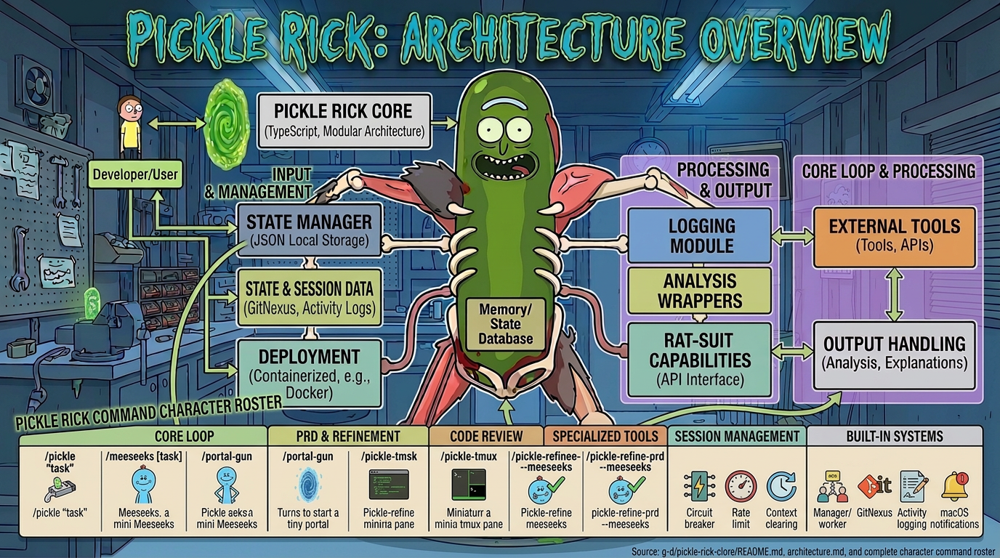

# Pickle Rick Grok — Architecture & Grok Integration

<p align="center">
  
</p>

**POST-REMOVAL NOTE (2026-05)**: The interactive LLM-as-manager path was deliberately removed. Current charter and execution model are in AGENTS.md "Core Execution Principle" (headless grok -p / orchestrator for all ticket execution, convergence, and 50-ticket self-runs; spawn_subagent rich teams ONLY inside /pickle-refine-prd for analysts). Any diagrams, P0 plans, or language in this historical document that appear to endorse or recommend an "Interactive Path (recommended)" or persistent Manager Rick loop are archival only and do not describe the production system.

This document explains how the autonomous engineering system is implemented natively for **Grok Build**, and how it differs from (and improves upon) the Claude Code version.

## Core Philosophy (Grok Native)

The original Pickle Rick was built around Claude Code’s strengths and limitations:
- Stop hooks for the Ralph Wiggum loop
- `claude -p` subprocesses for workers
- Heavy `settings.json` mutation and command registration

Grok Build gives us much better primitives:
- `spawn_subagent` with `fork_context: false` + `isolation: "worktree"`
- Background tasks + monitoring
- Headless mode (`grok -p`)
- Skills as first-class, discoverable extensions
- Named personas (`~/.grok/personas/`)

The Grok port is designed to **lean into these strengths** instead of fighting the old model.

## High-Level Architecture

```
User types /pickle-rick "build X"
          │
          ▼
Grok Skill (thin orchestrator + Rick voice)
          │
          ├── Interactive Path (REMOVED — historical only; see POST-REMOVAL NOTE)
          │     (The persistent "Manager Rick" LLM loop was deliberately deleted per AGENTS.md)
          │
          └── Detached / Pipeline Path  (PRODUCTION — the only supported path)
                └── /pickle-pipeline or /pickle-tmux
                    └── engine/src/bin/pipeline.ts (orchestrator)
                        └── real workers + citadel + anatomy + szechuan drivers
```

(Full diagram and more in the original internals + the engine README.)

## The Engine (the only thing that matters long-term)

All the hard autonomous logic lives in one place:

`~/.grok/pickle-rick-grok/engine/src/`

- `session.ts` + `types.ts` — state machine
- `iteration.ts` — ConvergenceLoop (the shared heart of microverse / anatomy / szechuan)
- `orchestrator.ts` — 8-phase headless ticket driver
- `workers.ts` — WorkerSpawner (headless + event wiring)
- `gate.ts`, `circuit.ts` — safety
- `ritual.ts` — single source of post-return promise/artifact/gate/rollback (no more duplication)
- `activity-logger.ts` — high-signal JSONL (now includes prd/refine/hardening/worker_spawned)
- `citadel.ts` — real 11-auditor v1.3 conformance (AC+Shape+Contract+ExpandedTrap+SelfMetaCross+Divergence+Hygiene+Ritual+SelfMetaModules; expanded from original 5-core + 15-auditor Claude)
- `anatomy.ts` — real 3-phase driver
- `szechuan.ts` — real principle convergence driver
- `bin/{pipeline,orchestrator,setup,metrics,standup,...}.ts` — the CLI surface

Everything else (skills) is thin prompt + delegation to the engine.

## Comparison Table

| Aspect                    | Claude Version                  | Grok Version (Current)                  | Winner |
|---------------------------|----------------------------------|------------------------------------------|--------|
| Worker isolation          | `claude -p` + Stop hook         | `spawn_subagent` + `fork_context:false` + worktree | Grok |
| Long-running              | tmux + mux-runner               | Background tasks + headless `grok -p`   | Grok (lighter) |
| Persona delivery          | Append to CLAUDE.md             | Named personas + skill references       | Tie |
| Installation complexity   | Heavy (hooks, settings.json)    | Simple (`install.sh` + personas)        | Grok |
| Subagent fan-out          | Agent tool (limited)            | Native `spawn_subagent` (parallel)      | Grok |
| Context control           | Hard (Stop hook hacks)          | First-class (`fork_context`)            | Grok |
| Post-build polish loop    | Citadel 15-auditors + anatomy + szechuan (real) | Same logic, real 11-auditor v1.3 deep drivers in TS (expanded + self-meta teeth), fully chained in pipeline | Tie (Grok cleaner) |

## Current Status (Honest — P3 polish complete for core)

- 8-phase ticket loop + orchestrator + gate + circuit + convergence drivers + ritual: real and wired + events.
- Full `/pickle-pipeline` chaining (refine → build → citadel → anatomy → szechuan): **real and production functional** (all drivers + logging + install verification).
- Citadel: real 11-auditor v1.3 deep audit (expanded from original 5-core + full 15-auditor Claude system; now includes self-meta cross-refs, ritual/persist coverage, divergence; sufficient and integrated).
- Post-return ritual: now consistent library code (`ritual.ts`).
- Observability: ActivityLogger wired everywhere (including new prd/refinement/hardening + worker_spawned); metrics/standup upgraded.
- Higher-tier (council/meeseeks/portal/plumbus): explicit deprecation stubs + notes only. Not required for real autonomous self-development.
- Install verification: covers the new wiring + TS import smoke for all drivers.

## Future / Nice-to-Have Grok Integrations

- MCP server exposing session/ticket status
- Custom dashboard component inside a skill
- Better structured output from subagents (JSON schemas)
- Native support for `PICKLE_GROK_ROOT` environment variable in the engine
- Port the remaining Tier 2/3 stubs if demand appears (low priority)

---

This document is the Grok-specific counterpart to the original `internals.md` and `ARCHITECTURE.md` files from the Claude version.

The goal is not to be a 1:1 clone, but to be the best possible autonomous engineering system *for Grok users* — and with P3 the core loop is there.

---
**Final Docs Polish (2026-05-18)**: AGENTS.md added at root for project-level honesty contract, trap doors, 50-tix rules, and stub status. All references to "project AGENTS.md" now satisfied. Higher-tier stubs remain explicitly noted. Self-loop 100% closed and accurate.
