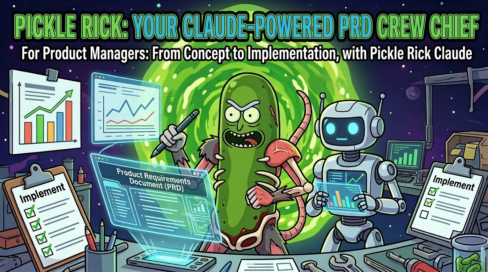

# Product Manager's Guide to Pickle Rick (Grok Build)

A practical guide for PMs who want to define work, refine it with AI analysis, and optionally launch autonomous implementation — without needing to understand the internals.

> **Note for Grok users**: This guide is adapted from the original Claude version. The core methodology is the same, but the underlying mechanics use Grok's native skills, subagents, and background tasks instead of Claude hooks.

---

## How It Works: Just Tell It What You Want

You don't need to memorize commands. Just describe what you need in plain language inside a Grok session in your project:

> "Help me create a PRD for caching the loan status API responses in Redis."

> "I have a prd.md — can you refine it and then build it?"

> "I want to build a feature that lets underwriters bulk-approve loans. Help me write the requirements."

That's it. The system recognizes your intent and **automatically activates the right workflow** — PRD drafting, refinement, implementation — without you needing to type a specific slash command (though you still can: `/pickle-prd`, `/pickle-refine-prd`, `/pickle-pipeline`, etc.).

### The System Explores Your Project For You

Once you describe your intent, the system **automatically explores your codebase** using Grok's tools (list_dir, grep, read_file, etc.) to understand what already exists. It finds relevant patterns, traces data flows, and identifies the exact files your feature will touch.

This exploration happens during:
- **PRD drafting** (`/pickle-prd`)
- **Refinement** (`/pickle-refine-prd`) — three AI analysts run in parallel across multiple cycles

### The Conversation That Builds Your PRD

The system doesn't just accept your description — it **interrogates you** to fill gaps:

- Why does this matter?
- Who is this for?
- What’s in scope vs out of scope?
- **How will we verify this automatically?** (the most important question)

Every requirement must have a machine-checkable verification (a test, a command, a type assertion, an LLM judge, etc.). Vague requirements are not allowed.

### What You Get Out

You get a structured `prd.md` with:
- Problem statement grounded in your actual codebase
- Clear scope
- Requirements with verification methods
- Interface contracts with real shapes from your code
- Test expectations
- Codebase context and existing patterns

If you then say “refine it” or “build it”, the system decomposes the work into atomic tickets and can launch autonomous implementation.

---

## Getting Started

### Recommended Flow (Natural Language)

1. Say: *"Help me create a PRD for [feature]"*
2. Have the interactive PRD interview
3. Review the generated `prd.md`
4. Say: *"Refine this PRD"*
5. Say: *"Build the tickets"* or *"Run the full pipeline"*

### Using Slash Commands Directly

You can also be explicit:
- `/pickle-prd "add user preferences API"`
- `/pickle-refine-prd`
- `/pickle-rick "build the tickets"`
- `/pickle-pipeline "refine then build the auth refactor"`

---

## Key Differences from the Claude Version

- **No hooks or settings.json mutation** — everything runs through Grok skills.
- **Subagents instead of subprocesses** — much better isolation (`fork_context: false` + worktree).
- **Personas** — named Morty personas (`morty-phase-implementer`, etc.) are first-class.
- **Installation** is dramatically simpler (`bash install.sh`).
- **Interactive mode is preferred**, but detached/background runs are still fully supported.

---

## Tips for PMs

- The more you can articulate **why** something matters and **how you will know it works**, the better the output.
- Don’t worry about perfect wording on the first try — the system will push you with good questions.
- Review the (now in-place refined) PRD before saying “build”. The quality of the requirements directly impacts the quality of the implementation. (Refinement overwrites the original draft by default.)
- Use `/help-pickle` anytime to see what’s available.

---

*Wubba Lubba Dub Dub. Now go ship something that doesn’t suck.* 🥒

---

*This guide is part of the Grok-native port of Pickle Rick. The underlying autonomous engineering methodology remains the same as the original Claude version — only the delivery mechanism has been rebuilt for Grok Build.*