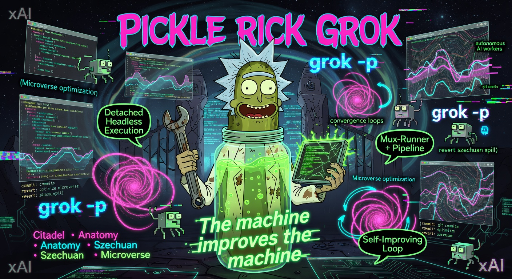

<p align="center">
  
</p>

# Pickle Rick Grok

**The production-grade, Grok-native autonomous self-improving engineering system.**

Pickle Rick Grok is the detached, crash-safe, resumable implementation of the full Pickle Rick agentic engineering loop, built on top of Grok's `spawn_subagent`, background tasks, and headless `grok -p` capabilities.

It turns a goal or PRD into shipped, reviewed, deslopped, and conformance-audited code — with the real heavy lifting done by a TypeScript orchestrator + headless workers, not by the LLM staying in the chat.

> **Core Principle**: Skills are thin dispatchers. The actual work (8-phase ticket lifecycle, convergence loops, self-improvement) runs in the detached engine (`mux-runner`, `orchestrator`, `pipeline`, drivers) using clean-context `grok -p` workers. Rich native `spawn_subagent` teams are restricted to one place only: PRD refinement.

---

## How to Build Things with Pickle Rick Grok

The flow is deliberately split:

- **Creative/high-judgment steps** (PRD drafting + refinement with analyst teams) can use rich native `spawn_subagent`.
- **Everything after tickets exist** must go through the detached headless engine.

### Step 1: Create a PRD

Just describe the goal:

```
"Help me write a PRD for adding a reliable background job system with retries and observability"
```

Or write `prd.md` yourself with machine-checkable acceptance criteria.

```bash
/pickle-prd
```

### Step 2: Refine the PRD (The One Allowed Rich Team Step)

```
"Refine the PRD"
```

This is the **only** place in the entire system where large parallel analyst teams (`requirements-analyst`, `codebase-analyst`, `risk-analyst`) run with cross-critique cycles via native `spawn_subagent`.

You get:
- `prd_refined.md`
- Atomic executable tickets
- Hardening tickets (Szechuan + Anatomy scoped to the diff)

### Step 3: Launch the Detached Build (The Real Work)

This is where it diverges from older interactive systems.

After you have tickets, you **do not** ask the LLM to stay in the chat and drive the loop.

Instead:

```bash
/pickle-tmux "Build the refined tickets"     # or
/pickle-pipeline --self-improvement "..."    # full chain + meta
```

Behind the scenes this dispatches to:

```bash
npx tsx ~/.grok/pickle-rick-grok/engine/src/runners/mux-runner.ts <SESSION_ROOT>
# or
npx tsx ~/.grok/pickle-rick-grok/engine/src/bin/pipeline.ts <SESSION_ROOT> --self-improvement --target .
```

You can (and should) run these with `background: true`. The process survives terminal close, machine sleep, etc.

Monitor with:
- `tail -f <session>/logs/*.log`
- `cat <session>/campaign-status.json`
- `/pickle-metrics` and `/pickle-standup` after it finishes

### Step 4: Convergence & Hardening (Optional but Recommended)

After implementation, run (or let the pipeline run):

- `/citadel` — conformance gate against the PRD
- `/anatomy-park` — deep data-flow review
- `/szechuan-sauce` — principle-driven deslopping
- `/microverse` — metric-driven optimization (coverage, latency, etc.)

### Self-Improvement (Dogfooding)

The ultimate mode:

```bash
/pickle-pipeline --self-improvement --target .
```

This runs the generator → full pipeline on the generated tickets → closer → feeds the next campaign via `reliability-backlog.md`.

---

## Quick Start

1. Run `bash install.sh` from this repo (after you've run Grok at least once so `~/.grok` exists).
2. The skills and personas are installed to `~/.grok/skills/pickle-rick-grok` and `~/.grok/personas`.
3. Use the commands in any Grok conversation. The skills dispatch to the real engine at `~/.grok/pickle-rick-grok/engine`.

See `INSTALL.md` and `AGENTS.md` (both in this repo and the installed copy) for details.

---

## Monitoring & Observability

- Live: `tail -f <session>/logs/*` and `campaign-status.json`
- Post-run: `/pickle-metrics --days 7 --json` and `/pickle-standup`
- Self-loop health: `reliability-backlog.md` (written by the closer after `--self-improvement` runs)

---

## Honest Port Status

**Fully real & production-viable**:
- Orchestrator + mux-runner + ritual + gates + circuit
- Citadel, Anatomy Park, Szechuan Sauce, Microverse drivers
- Self-PRD generator + loop closer + reliability-backlog
- All core skills dispatch correctly to the headless engine

**Honest stubs** (higher-tier commands that are not yet ported):
- Council of Ricks, Meeseeks, Portal Gun, Plumbus, some legacy slash commands.

See `SKILL_MANIFEST.md` and `help-pickle` for the current surface.

---

Wubba Lubba Dub Dub.

The pickle only runs when the machine is in charge.

---

## Command Deep Dives

These are the primary user-facing entry points. All of them are thin dispatch skills — they tell the model to launch the real detached TypeScript engine (`mux-runner`, `pipeline.ts`, individual drivers) with `background: true`. The actual work never happens inside the chat.

### `/pickle-pipeline` — The Whole Damn Thing

<p align="center">
  
</p>

One command for the complete lifecycle:

- Optional PRD refinement (the only place rich analyst `spawn_subagent` teams are allowed)
- Detached build via `mux-runner` + full 8-phase orchestrator
- Real Citadel gate
- Real Anatomy Park 3-phase review
- Real Szechuan Sauce convergence deslopping
- Optional `--self-improvement` for the full meta loop (self-PRD generator + closer + reliability-backlog ingest)

**Fire and forget.** The model only stays long enough to emit the correct `npx tsx .../pipeline.ts` or `mux-runner` invocation.

See `skills/pickle-pipeline/SKILL.md` and `engine/src/bin/pipeline.ts`.

### `/pickle-tmux` — Long-Running Detached Execution

<p align="center">
  
</p>

The primary production path for serious epics. Launches the hardened `mux-runner` (with `PICKLE_FORCE_HEADLESS`, graceful shutdown, heartbeats, `campaign-status.json`, full ritual + gate + circuit).

You can close the terminal. The run survives and is resumable.

### `/microverse` — Metric-Driven Convergence

<p align="center">
  
</p>

Optimize a numeric command output or LLM-judge goal through many tiny, automatically-reverted changes with rigorous gates and failed-approaches ledger.

**Important (post-hardening):** The rich inline `spawn_subagent` loop is now explicitly scoped as a tiny local experiment only. Real or overnight convergence work dispatches to the detached driver.

### `/anatomy-park` — Deep Subsystem Review

<p align="center">
  
</p>

Discover subsystems, run the 3-phase protocol (Review → Fix → Verify with automatic rollback on regression), and catalog trap doors.

Usually invoked as part of the pipeline, but can be run standalone.

### `/szechuan-sauce` — Principle-Driven Deslopping

<p align="center">
  
</p>

Runs the full expanded principle catalog (KISS, DRY, SRP, security, cognitive load, monetary precision, audit trail, etc.) with confidence filtering and priority elevation for financial code. Continues until zero violations or stall limit.

### `/citadel` — Conformance Gate

Real 5-auditor v1.1 core (with self-meta and trap-door scanning). The hard spec-is-the-review gate that runs after implementation and before deeper cleanup.

---

See individual `skills/*/SKILL.md` files and `/help-pickle` for the full current surface (including honest stubs for higher-tier commands that are not yet ported).
