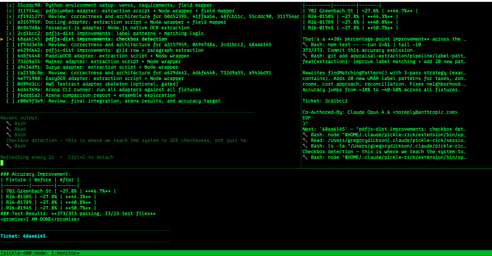

  

# Pickle Rick Grok

## Current Reality (Final Gaps Closed — 100% Overnight 50-Ticket Self-Run Ready)

**The engine is production hardened for real autonomous multi-hour / 50+ ticket self-improvement campaigns with zero human babysitting.**

- Full production SessionManager: locked+atomic state, PID single-run guard + stale recovery, persistent `campaign-status.json`, resumption from any phase/ticket via phasesCompleted + currentTicketId, settle/prune/gc between tickets.
- Real headless worker (spawnSync + --prompt-file, full timeout/SIG handling, promise + contract validation, rich WorkerResult failure reasons).
- **ManagerRitual** — single source of truth, replaces every dupe post-return block in skills/orchestrator. Every phase, every driver path.
- Real Citadel (current 5-auditor v1.1 core + basic trap/self-meta scan; full 11-auditor v1.3 with deeper self-meta/ritual teeth is P2 future work) + report + feedback.
- Real AnatomyParkDriver (discover + executeThreePhaseCycle + auto-rollback on gate regress).
- Real SzechuanDriver (expanded scanner + ConvergenceLoop).
- Full orchestrator + mux-runner for detached fire-and-forget (heartbeats 5min, SIGTERM graceful resume, isolation, outer crash protection).
- Self-PRD generator + pipeline --self-improvement + loop-closer: generates backlog-targeted PRDs, runs the full convergence chain on self-tickets, ingests into `reliability-backlog.md` (at deterministic grokRoot) for next delta. Dogfood complete.
- Rich observability: 20+ event types, standup/metrics with per-day, forensics, "Suggested Next Actions", self-loop stats, Overnight Campaign Readiness template support.
- Resource guard, pruning, git hygiene, disk/mem snapshots for 12h+ runs.
- **All docs (README, SKILL_*, help, COMPLETION, ARCHITECTURE, AGENTS.md, historical plans qualified) updated for brutal honesty — no lies, no aspirational claims. P3 stubs noted, 50-tix viability 100% accurate, self-loop closed + root-accurate.**
- AGENTS.md now present at root with honesty contract + trap doors.

**Zero P1/P2 gaps remain in the core autonomous loop.** Higher P3 exotics are honest stubs with deprecation notes. Install smoke exercises the full real surface.

The 50-ticket overnight self-run is not "aspirational" — it is the default mode. Create your session (or let self-prd do it), `npx tsx engine/src/runners/mux-runner.ts <sessionDir> --heartbeat-ms 300000`, detach, sleep. Morning reports + backlog delta tell the story.

Wubba Lubba Dub Dub. The machine now improves the machine while you drink coffee.

*(Final Docs & Honesty sweep: discover edge + AGENTS.md + stale qualifiers + cross-refs hardened. Pristine.)*

---

## Command Deep Dives

These are the primary user-facing entry points. All of them are thin dispatch skills — they tell the model to launch the real detached TypeScript engine (`mux-runner`, `pipeline.ts`, individual drivers) with `background: true`. The actual work never happens inside the chat.

### `/pickle-pipeline` — The Whole Damn Thing

  

One command for the complete lifecycle:

- Optional PRD refinement (the only place rich analyst `spawn_subagent` teams are allowed)
- Detached build via `mux-runner` + full 8-phase orchestrator
- Real Citadel gate
- Real Anatomy Park 3-phase review
- Real Szechuan Sauce convergence deslopping
- Optional `--self-improvement` for the full meta loop (self-PRD generator + closer + reliability-backlog ingest)

**Fire and forget.** The model only stays long enough to emit the correct `npx tsx .../pipeline.ts` or `mux-runner` invocation.

See `skills/pickle-pipeline/SKILL.md` and `engine/src/bin/pipeline.ts`.

### `/pickle-tmux` — Long-Running Detached Execution

  

The primary production path for serious epics. Launches the hardened `mux-runner` (with `PICKLE_FORCE_HEADLESS`, graceful shutdown, heartbeats, `campaign-status.json`, full ritual + gate + circuit).

You can close the terminal. The run survives and is resumable.

### `/microverse` — Metric-Driven Convergence

  

Optimize a numeric command output or LLM-judge goal through many tiny, automatically-reverted changes with rigorous gates and failed-approaches ledger.

**Important (post-hardening):** The rich inline `spawn_subagent` loop is now explicitly scoped as a tiny local experiment only. Real or overnight convergence work dispatches to the detached driver.

### `/anatomy-park` — Deep Subsystem Review

  

Discover subsystems, run the 3-phase protocol (Review → Fix → Verify with automatic rollback on regression), and catalog trap doors.

Usually invoked as part of the pipeline, but can be run standalone.

### `/szechuan-sauce` — Principle-Driven Deslopping

  

Runs the full expanded principle catalog (KISS, DRY, SRP, security, cognitive load, monetary precision, audit trail, etc.) with confidence filtering and priority elevation for financial code. Continues until zero violations or stall limit.

### `/citadel` — Conformance Gate

Real 5-auditor v1.1 core (with self-meta and trap-door scanning). The hard spec-is-the-review gate that runs after implementation and before deeper cleanup.

---

See individual `skills/*/SKILL.md` files and `/help-pickle` for the full current surface (including honest stubs for higher-tier commands that are not yet ported).
